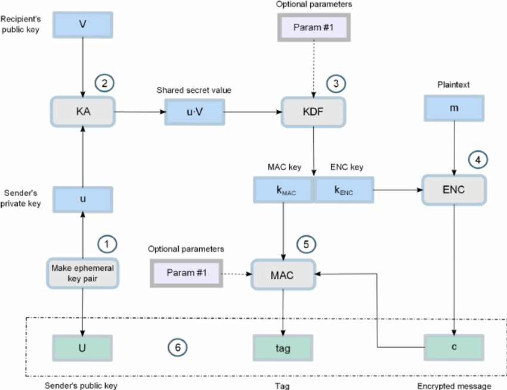
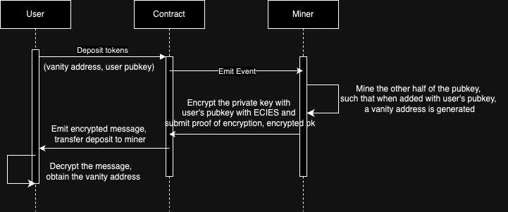
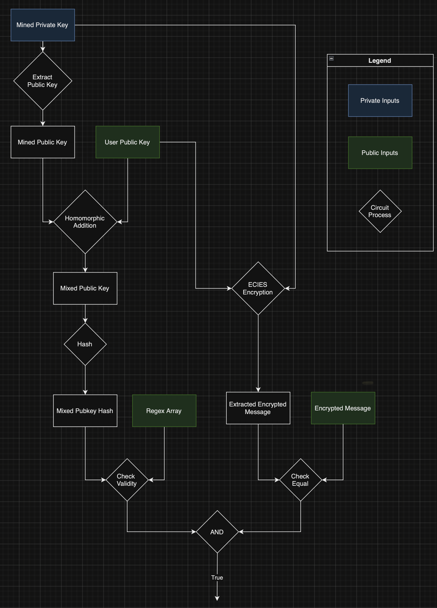

# [ECIES Implementation in Circom]

## [Section 1] Project Information

- **Project Name:** Circom-native ECIES Implementation

- **Payment Details:** 0xdbA5E670EC1575EefAE0653Bbb1bba0Eb096488b on Polygon

- **Total Amount Requested:** 7500 USDC

## [Section 2] Project Overview :page_facing_up:

### **Brief Description:**

The Elliptic Curve Integrated Encryption Scheme (ECIES) is a hybrid encryption scheme that combines ECC-based asymmetric cryptography with symmetric ciphers to provide data encryption. It uses a public key and a secret random scalar for encryption, and the corresponding EC private key and public representation of the secret random scalar for decryption. A Message Authentication Code (MAC) is included to ensure the integrity of the encrypted message. All the components required are used in the following way: 

The project aims to optimize the ECIES implementation for decentralized environments, improving user experience in scenarios like marketplaces, auctions, and secure data exchange. It also addresses deadlock situations in information sharing by using ZKP to incentivize secure message sharing.

This protocol will also be used in a sample app to demonstrate the capabilities of ECIES. The app is a Zk-powered vanity address generator that only makes use of on-chain interactions to mine and generate vanity address while also revealing nothing about the mined private key or the generated vanity address. The sequence diagram is shown below:

The flow is as follows: 
1. The user submits a request to generate the vanity address. He provides the vanity address pattern he wants, and his own public key along with payment for the work done by the miner. 
2. The contract accepts the user's request and emits an event for the miner.
3. The miner mines another private key such that when converted to a pubkey and added to the user's pubkey, will generate the user's vanity address. 
4. The miner encrypts the private key with the user's pubkey using ECIES. (The user's pubkey is used to derive a shared secret using ECDH and is later encrypted using AES-CTR).
5. The encrypted message and proof of encryption are submitted on chain. If the proof of encryption is correct then an event is emitted containing the encrypted messsage. 
6. The user decrypts this message (as he can derive the shared secret as well) and use result of adding his private key and the decrypted private key to generate the vanity address. 

In an in-depth flow chart of how the encryption is provided below: 

### **Core Idea:**

The primary goal is to implement a production-grade ECIES encryption scheme with Zero-Knowledge Proofs (ZKP) in Circom, optimized to reduce the number of constraints and operations. This eliminates the need for a separate key exchange protocol, requiring only the recipient's public key for message encryption. The addition of ZKP allows proving that the message is encrypted using the recipient's public key and meets predefined requirements without revealing the content.

### **Technology Stack:**

- Circom (for circuits)
- Circomkit (ts based testing framework)
- Golang (POC's for individual components)

### **Key Components:**

- HMAC implementation with SHA-256
- Key Derivation Function (HKDF with SHA-256)
- AES-CTR implementation
- ECC operations (scalar multiplication)

### **Design/SPEC:**

https://hackmd.io/zGQFexzNR-2T4sW_trO8AQ : contains a detailed explanation and implementation procedure.

### **References:**

- ECIES specification can be found at:
1. https://cryptobook.nakov.com/asymmetric-key-ciphers/ecies-public-key-encryption
2. Simplified version of the explanation can be found here : https://hackmd.io/zGQFexzNR-2T4sW_trO8AQ#ECIES-Encryption-Scheme-Specifications

- Official implementation for in golang can be found here : https://github.com/ecies/go

- Profanity-V2 maintained by 1Inch which Zanity will be benchmarked against can be found here : https://github.com/1inch/profanity2

- [AES Specs](https://nvlpubs.nist.gov/nistpubs/FIPS/NIST.FIPS.197-upd1.pdf)
- [HMAC RFC 2104](https://datatracker.ietf.org/doc/html/rfc2104)
- [KDF](https://nvlpubs.nist.gov/nistpubs/SpecialPublications/NIST.SP.800-56Ar3.pdf)

### **Security considerations:**
- ECIES
  - ECIES will provide a channel for two parties to exchange information taking full advantage of the already widely adopted ethereum wallets and ecsda keys
  - ZK proofs will ensure the correctness of encryption which will reduces trust assumptions during a data exchange session.
  - AES with CTR mode is core encryption algorithm . We are using our own implementation here at : https://github.com/crema-labs/aes-circom
    -  This is peer reviewed by [Pluto](https://pluto.xyz) : https://github.com/pluto/aes-proof/pull/35
    -  Key derivation was reviewed and improved by core zk folks from 0glabs : https://github.com/crema-labs/aes-circom/pull/7
- Zanity(example use case)
  - Zanity is an example implementation of ECIES for out sourcing generation of vanity address
  - In Zanity only the user requesting for the vanity address will be able to generate the private key of vanity address for a particular chain.
  - A spiteful miner can only cause the resultant vanity public key to be revealed thus we suggest users to assume that their custom vanity address will be public.
  - To obscure the creator of this request to be linked back to the vanity address we recommend using various relayer options available for ethereum and other chains.
  - We are ideating a very cool implementation to secure ,via obscurity, the vanity address where a user shares commitments for public key via `g^x` and `g^y` and the miner will be forced to call calculate `g^xm` and `g^ym` where the point addition with corresponding pairing of these commitments with will be compared with the target vanity commitments `g^xt` and `gyt`. This will ensure that even the miner does not know the public key of the vanity address.
  - Fundamental FHE libraries don't exist for achieving this on circom and will take lot of efforts to make them performant thus are planned to be implemented in future.

## [Section 3] Ecosystem Fit

This project brings several unique contributions to the Circom ecosystem:

1. **ZKP-Enabled ECIES**: It provides a full implementation of ECIES with integrated Zero-Knowledge Proofs, allowing for provable encryption without revealing message contents. This is particularly valuable for decentralized applications requiring secure, verifiable communication.

2. **Comprehensive Cryptographic Primitives Suite**: By implementing not just ECIES, but also its component parts (HMAC, HKDF, AES-CTR) in Circom, the project provides a broader cryptographic toolkit for the ecosystem.

3. **Optimized and ready for production**: The project aims to optimize the implementation to reduce the number of constraints and operations, making it more efficient for use in ZKP circuits right out of the box. Crema team will be ready to resolve and review issues ASAP in the entire suite.

4. **Use Case Demonstrations**: The project plans to implement practical use cases like a ZK Vanity Address Generator, showcasing how ECIES with ZKP can be applied in real-world scenarios. The use case, Zanity, will also implement mining algorithm that will be benchmarked again Profanity v2 from 1Inch which was aimed at outsourcing vanity address generation safely.

5. **Standardization**: By implementing multiple standards (different key lengths, curve types), the project aims to provide a flexible, standardized approach to ECIES in the Circom ecosystem.

6. **Security Focus**: The project addresses specific security considerations, such as preventing key reuse through nullifier outputs, enhancing the overall security of ZKP applications using this implementation.

These contributions fill significant gaps in the Circom ecosystem, providing developers with powerful tools for implementing secure, provable encryption in decentralized applications. This can enable new use cases in areas like private auctions, secure bridges between chains, and other scenarios requiring verifiable yet confidential data exchange.

## [Section 4] Team :busts_in_silhouette:

### **Team Members:**

- [0xVikasRushi](https://github.com/0xvikasrushi)
- [Ayman](https://github.com/nesopie)
- [yash1io](https://github.com/yash1io)

### **Contact Information:**

- **Name:** Ayman
- **Email:** aymanshaik1015@gmail.com
- **Discord**: nesopie

### **Prior Work/Research (Optional):**

- Implemented [ECDSA secp384r1](https://github.com/crema-labs/ecdsa-p384-circom)
- Implemented [Generic AES Circom](https://github.com/crema-labs/aes-circom)
- Implemented First AES Circom [CTR Mode](https://github.com/crema-labs/aes-circom/blob/main/circuits/ctr.circom)
- Implemented [hmac with sha256](https://github.com/crema-labs/hmac-circom) in circom
- Implemented [Circom ASN.1 Parser](https://github.com/zkemail/asn1-parser-circom)

### Links

- Github : https://github.com/crema-labs
- Blog : https://blog.crema.sh
- Website: https://crema.sh/

## [Section 5] Development Roadmap :open_book:

### Milestone 1 — Implementing the building blocks for ECIES

- **Estimated Duration:** 2 weeks

- **Description:** This involves implementing the underlying components for ECIES, testing and documenting them. This includes implementing AES, HMAC for authentication, and HKDF for the key derivation. Tests will be taken from the official NIST test vectors. We already have a working implementation of AES in Circom. We will also implement ECDH for the shared key derivation over secp256k1 and secp256r1 curves.

- **FTE (Full-Time Equivalent):** 1.5 FTE (0.5 \* 3).

- **Costs:** 4,500 USDC
  - Refactoring, updating AES and making it well-constrained and optimised. (2000 USDC)
  - Optimising our existing HMAC implementation and implementing HKDF. (1000 USDC)
  - Adding NIST test vectors for all of the above primitives. (1000 USDC)
  - Thorough documentation of the code and also for usage for people planning to integrate and publishing packages for public use. (500 USDC)

### Milestone 2 — Implementing an example use-case for ECIES

- **Estimated Duration:** 2 weeks

- **Description:** Zanity. A zk-enabled vanity address generator. Zanity is a marketplace where people come and request miners for a vanity address by depositing some. The miners then generate a vanity address and encrypt it (the mined private key) using the requesters public key. The miner then also generates a proof that the address is properly encrypted and posts it on chain. Once the proof is verified, the requester can then decrypt the message, receive the new private key. The new private key is added to his original private key and from here, the new address can be generated.

- **FTE:** 1.5 FTE

- **Costs:** 3,000 USDC
  - Implementing the vanity address miner capable of generating different types of addresses (Ethereum, Bitcoin (p2pkh, p2wpkh, p2tr)). (1000 USDC)
  - Writing circuits for the vanity address verification. (1000 USDC)
  - Smart contracts that make use of the circuits and a deployed frontend for the vanity address generation so that users can play around. (1000 USDC)

### Total Costs: (e.g. 4,500+3,000 = 7,500 USDC)

## [Section 6] Extended Scope

- **Future Plans:**

Apart from maintaining the implemented the cryptographic primitives (AES, HMAC, HKDF, ECDH), we plan to explore further use-cases ECIES and homomorphic encryption. We also plan on building Pebbler - a privacy enabled exchange solution that provides a safe space for people to move funds from one chain to another without revealing their identities. This makes use of homomorphic encryption to ensure that no one can see the generated addresses.
