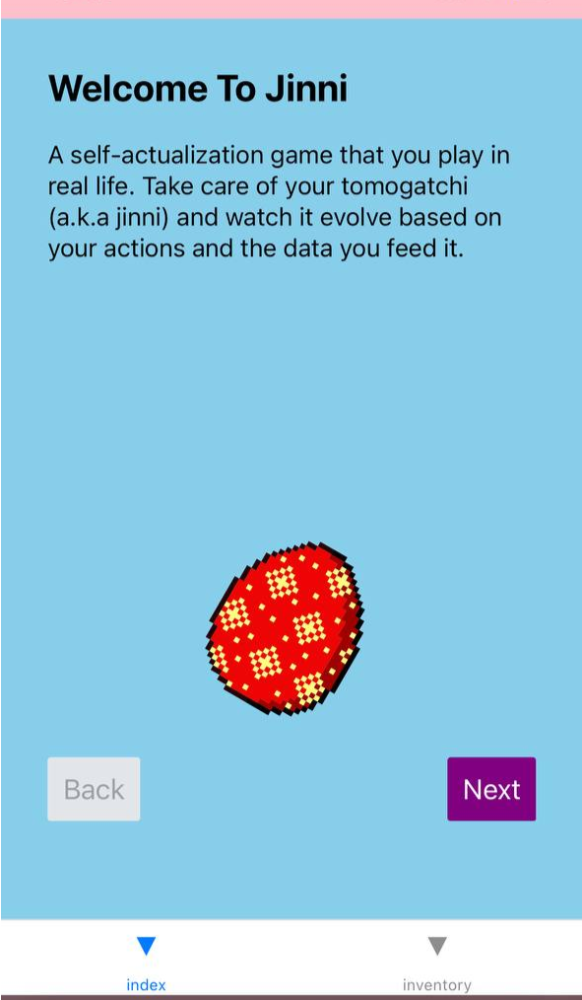
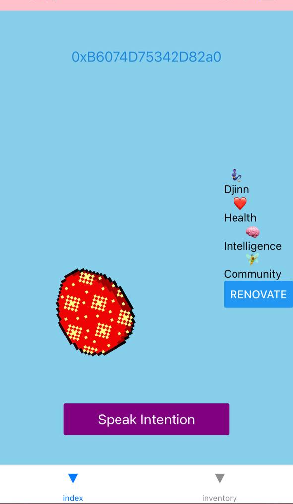
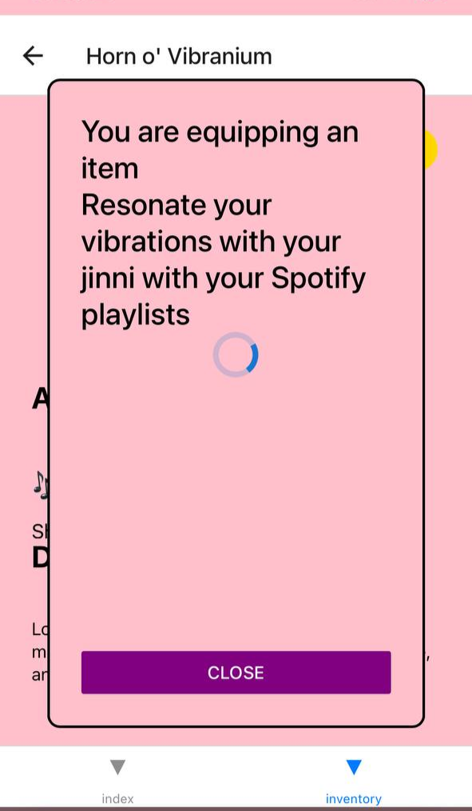

# Jinni Health

## [Section 1] Project Information
-  **Project Name:** Jinni Health

-  **Payment Details:** 0x004C1193262542ffF59e64fF29404DEAeb3F3dEC

-  **Total Amount Requested:** $4,000

## [Section 2] Project Overview

-  **Brief Description:**

Jinni is a self-actualization game based on tamagotchis. Your virtual pet feeds off data on what you do in the real world to evolve and take care of it using Apple Health, Spotify, Github, and other sources you already use on a daily basis. The Jinni app is available on [web](https://app.jinni.health) and [Android store](https://scryer.jinni.health/portals?name=install-android).

Because it is a game about life i have been integrating the [arx](arx.org) NFC hardware wallets to enable gameplay which uses the babyjubjub curve so I want to use that curve for the other parts of my app also for simplicty in addition to its benefits

My proposal is to add client side ZKP generation for data from real-world actions on  native mobile apps like Android Health Connect data about physical exercise, NFC signatures data about physical interactions, and photo gallery access for proofs about many things. For example a ZKP saying "I ran 10 miles the week of Nov 10th" will replace the current setup of my game where the player uploads data about every walk and run tracked by their phone and then i use a fraction of the data for their tamagotchi. This will be built with Circom circuits and snarkjs

-  **Core Idea:**

Using native mobile app to generate ZKP on data about real world activities like running, social interactions, and photos. This ZKP replaces current raw data in game for evolving your tamagotchi based on what you do in life.

The idea of Jinni is that you play the game in real life. The app is just a dashboard or settings menu that you use for the meta of the gameplay. Everyone has different directions they want to self-actualize in so our algorithms need to incorporate a variety of lifestyles and activities. We connect with apps and services people already use to capture data automatically to constantly take care of your tamagotchi. 

It would save us engineering complexity from having to store all that data when a proof can achieve the same thing and the players data can remain private, anonymous, and secure. 

-  **Technology Stack:**

List the technologies, tools, platforms, and frameworks you plan to use in your project.

  Frontend https://github.com/kibagateaux/jinni-mobile-app/
  - React Native
  - Expo
  - ethersjs
  - circom
  - snarkjs
  - NFC
  - arx
  - Apps: Apple + Android Health, Spotify, Strava, Github

Backend https://github.com/kibagateaux/master-djinn/
  - Web3j
  - Neo4j
  - DALLE
  - Apps: Spotify, Strava, Github

---

- **Design Mockups/Prototypes (Optional):**

Jinni Health game onboarding and home page

 

Modals while receiving NFC chips and waiting for proof verification

 

## [Section 3] Ecosystem Fit

  

-  **Similar Projects:**
Jubmoji and other work by the Cursive team is definitely an inspiration and a code source on frontend. They focus on NFC and only have a webapp. They dont have a native app or a game whose core mechanic incentives data collection while also using that data collection to benefit the player. There are other health-gamification and GameFi projects that use the tamagotchi analogy. All these other apps are one-dimensional (only sleep or only walking, never both), misuse financial incentives where internal motivation is best, and dont have compelling, long lasting, sticky gameplay.
  

-  **Unique Contribution:**
Testing performance optimization of plonky3 on native mobile apps. Getting use from diversity of users and different mobile devices. Applying privacy to health data and health gamification with personal data.

## [Section 4] Team :busts_in_silhouette:

-  **Team Members:**
-  **Contact Information:**

-  **Name:** Name of the primary contact person.
Kiba Gateaux

-  **Email:** Email address of the primary contact person.
zahhi@jinni.health  

-  **Prior Work/Research (Optional):**

Kiba Gateaux is a fullstack engineer, DeFi dev, and interactive artist. He previously founded Debt DAO and Data Economy Index, contributed at leading projects like ConsenSys, Index Coop, and CREAM and building React Native apps for 7 years.

## [Section 5] Development Roadmap :open_book:

### Milestone 1 — Generate proofs in app
-  **Estimated Duration:** 1 month

-  **Description:** 
1. Integrating snarkjs/circomlibjs into mobile app (already done)
1. Finalize circuit requirements and design
1. Writing circuit in circom
1. Generating proof with circomlibjs
1. Use jubjub curves in signature provided to proof

-  **FTE (Full-Time Equivalent):** 1 FTE

-  **Costs:** $2,000
  

### Milestone 2 — Validate proofs inapp (without game server)
-  **Estimated Duration:** 1 month

-  **Description:**
1. use snarkjs proof verification in frontend
1. Use jubjub curve in proof verification of signature

-  **FTE:** 1 FTE

-  **Costs:** $2,000

  
### Total Costs: 2,000 + 2,000 = 4,000 USDC

## [Section 6] Extended Scope

-  **Future Plans:**

Getting use from a diversity of users and different mobile devices. 
I could work on compiling and distributing plonky3 for web and native JS apps.
There is other data we can generate like event checkins, attestations of accomplishing goals, etc. that could require new proofs. More prrofs could likely lead to some tooling being needed.
