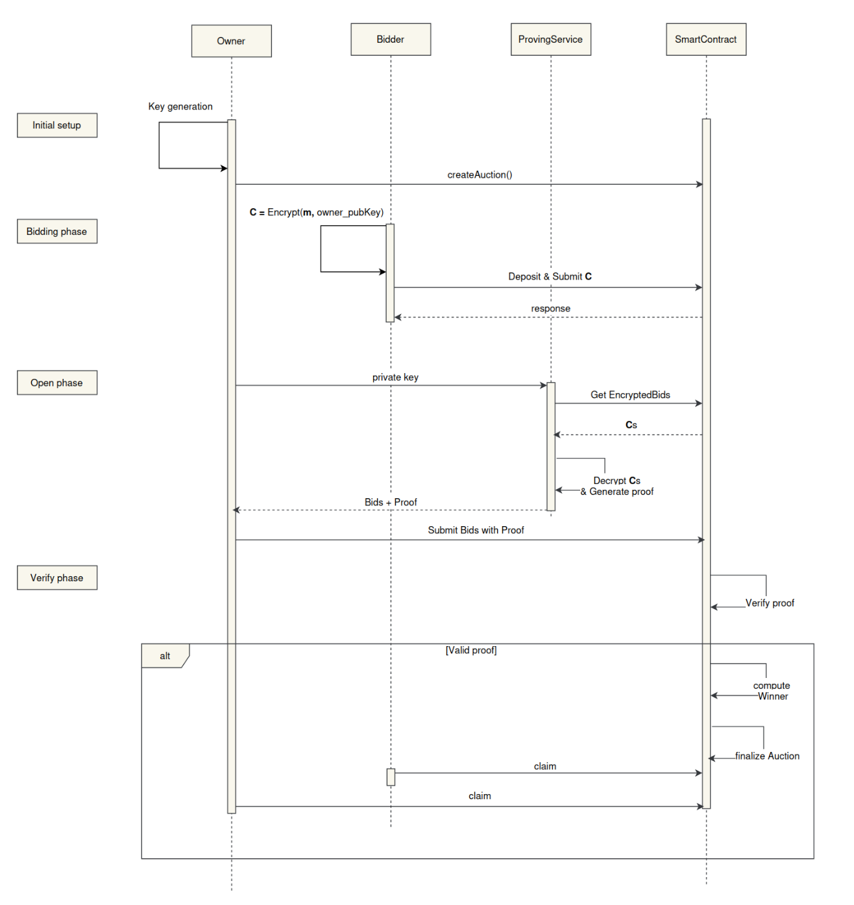

# SilentBid - Bringing Sealed-Bid Auctions On-Chain

## [Section 1] Project Information

- **Project Name:** SilentBid - On-chain Sealed-Bid Highest Auction
- **Payment Details:** 0x9efE53369D4894Ca22C63f489023B324C3D519BA (Polygon Network)
- **Total Amount Requested:** 6,500 USDC

## [Section 2] Project Overview :page_facing_up:

### Brief Description

**SilentBid** is a [**Sealed-Bid Auction**](https://www.investopedia.com/terms/s/sealed-bid-auction.asp) platform built using the
**Plonky3** toolkit. The project aims to facilitate secure and private auctions by leveraging **zero-knowledge proofs (ZKPs)** to
determine the highest bidder without revealing individual bid amounts. This ensures both privacy and fairness in the bidding process.

Additionally, **SilentBid** serves as a **reference model** for developers interested in building decentralized applications (dApps)
using **Plonky3** and **ZKPs**.

### Core Idea

At the bidding phase, bidders submit encrypted bids to a smart contract, which only the auction owner can decrypt using their secret 
key. Then in opening phase, the owner publishes the decrypted bid amounts and also the ZK proof of the decryption process, including 
the hash of all the inputs. Finally, the smart contract will verify the proof, compute and publish the winner.

Key components of the project include:

- **Proving Service**: Powered by **Plonky3**, this service generates a **zero-knowledge proof** from the execution trace of a program
  that decrypts bids, while preserving the confidentiality of owner's private
  key.
- **Smart Contract**: The smart contract verifies the ZK proof, computes the winner and manages the entire auction lifecycle, including setup, bidding, and
  settlement.

### Technology Stack

- **Smart Contract**: Solidity
- **Circuit**: Rust, Plonky3
- **Encrypt/Decrypt**: RSA 32-bit
- **Hash function:** Rolling Hash

### Design Mockups/Prototypes (Optional)

The core logic of **SilentBid** operates on-chain, while off-chain processes handle the decryption and proof generation. The
auction process follows four main phases:

1. **Initial Setup**: The auction owner creates the auction, sets the required deposit amount, transfers assets to the smart contract,
   and defines the auction's start and end times.
2. **Bid Phase**: Bidders submit their bids to the smart contract by depositing the required amount.
3. **Open Phase**: After the bidding window closes, the auction owner decrypts the bids and generates a zero-knowledge proof.
4. **Verify Phase**: The owner submits the decrypted bids and the proof to the smart contract for verification. The smart contract then computes and publishes the winner.

**Sequence diagrams for each module are shown below:**

#### Auction Flow:

### Challenges

Currently, the field allowed in the constraints is `AbstractField`, which has a maximum size of 64 bits (if we use Goldilocks). 
However, we want to use a 256-bit curve for encryption/decryption, or, if we use RSA, the required bit size is 1024 bits. To implement 
this in Plonky3, we need to break numbers into smaller parts, which is very complex.
Another issue is that Plonky3 only supports basic operations, like addition, subtraction, and multiplication, in the cell 
values of the execution trace, which are insufficient for the decryption phase.

Therefore, we decided to use a simplified version for encryption/decryption and also for the hash function. We use RSA with 32 bits and 
a Rolling Hash, both of which fit within the field size. We believe that this simplified version does not affect the purpose of our project, as it serves as a reference structure and provides insights into where Plonky3 is suitable and where it may have limitations.
## [Section 3] Ecosystem Fit

### Similar Projects

Several research papers have explored sealed-bid auctions on the blockchain,
including [Anonymous Fair Auction on Blockchain](https://ieeexplore.ieee.org/document/9432664)
and [A Blockchain-Based Sealed-Bid e-Auction Scheme with Smart Contract and Zero-Knowledge Proof](https://www.researchgate.net/publication/351717293_A_Blockchain-Based_Sealed-Bid_e-Auction_Scheme_with_Smart_Contract_and_Zero-Knowledge_Proof).
However, these solutions often assume the verifier holds both a private and public key, which is impractical for smart contracts.
Projects like [AuctionContract](https://github.com/HSG88/AuctionContract) focus on developing business logic inside a smart contract
but do not provide a complete solution for secure and private auctions.

### Unique Contribution

**SilentBid** provides a **practical reference** for developers aiming to build **ZK-based dApps**, demonstrating how **Plonky3**can
address real-world problems.

## [Section 4] Team :busts_in_silhouette:

- **Team Members:** We are part of [SotaZK Labs](https://sotazk.org/), a team focused on pioneering zero-knowledge solutions to enhance
  security and privacy in the decentralized world.
- **Number of Members**: 7
- **Contact Information:**
    - **Name:** Steve Nguyen
    - **Email:** zk.steve.nguyen@gmail.com
    - **Telegram:** @zk_steve
- **Prior Work/Research (Optional):**
    - [ZKP Documentation](https://github.com/sota-zk-labs/zkp-documents): A repository dedicated to demystifying zero-knowledge proof
      technology, including KZG, GKR, FRI, Plonk, Groth16, lattice-based commitment schemes, sum-check protocol, Nova, EIP-4844, etc.
    - [ZKP Implementation](https://github.com/sota-zk-labs/zkp-implementation): Various ZKP protocols, including KZG, FRI, and Plonk.
    - [Apstark](https://github.com/sota-zk-labs/apstark): A layer 2 ZK rollup blockchain built on the Aptos network using the Starknet
      tech stack.

## [Section 5] Development Roadmap :open_book:

> **Important:** The maximum project duration is 6 weeks. Milestones and timelines are outlined accordingly.

### Milestone 1 — Basic Functionality

- **Estimated Duration:** 4 weeks
- **Description:** Implement the core functionalities, including the smart contract with auction and verification features, and the
  proving service on the client side.
- **FTE (Full-Time Equivalent):** 4 FTE
- **Costs:** 4,000 USDC

### Milestone 2 — Additional Features

- **Estimated Duration:** 2 weeks
- **Description:** Refine the code, fix bugs, and create tutorials (documents and videos) for developers.
- **FTE:** 4 FTE
- **Costs:** 2,500 USDC

### Total Costs: 6,500 USDC

## [Section 6] Extended Scope

### Future Plans

Post-development, we plan to integrate additional auction types, such as **Unique Lowest Bid Auctions** and **Dutch Auctions**. We also
aim to collaborate with other **dApps**, potentially with **DeFi platforms**, to allow for automatic asset management following auction
outcomes.