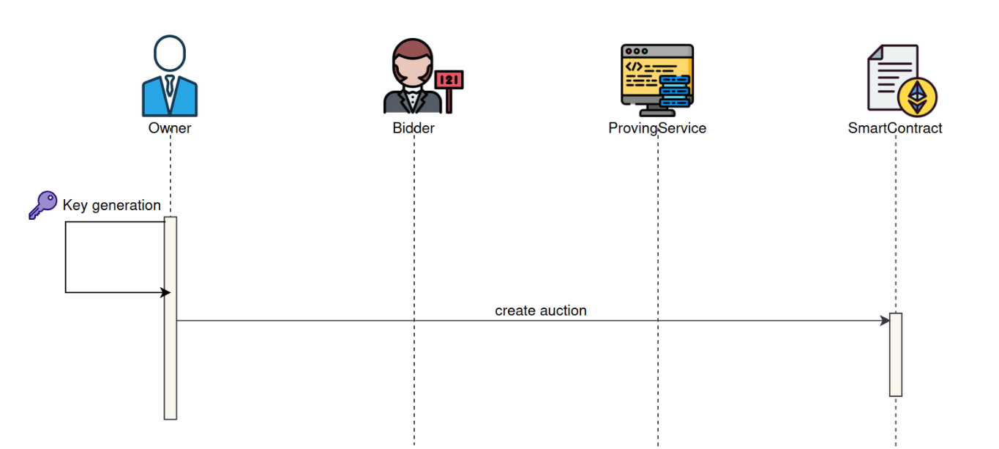
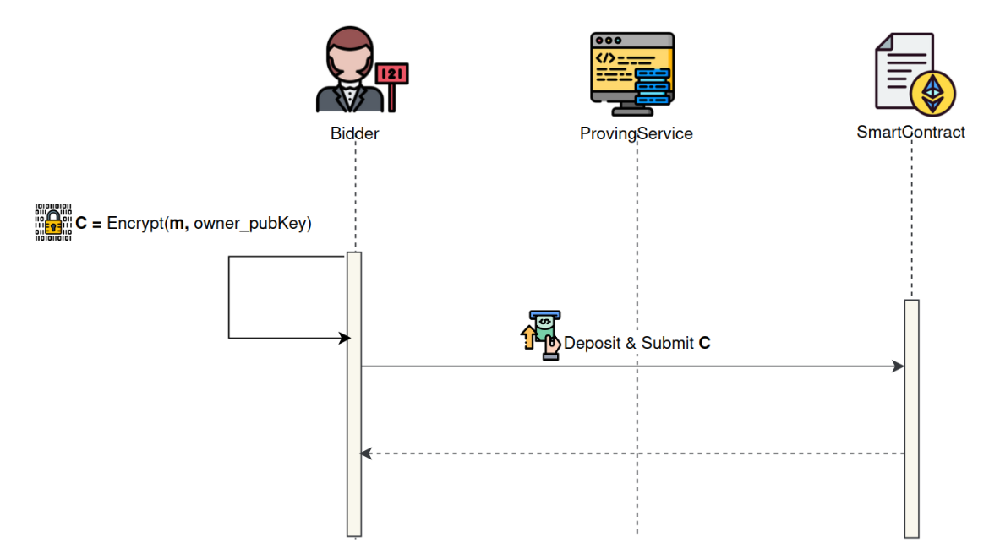
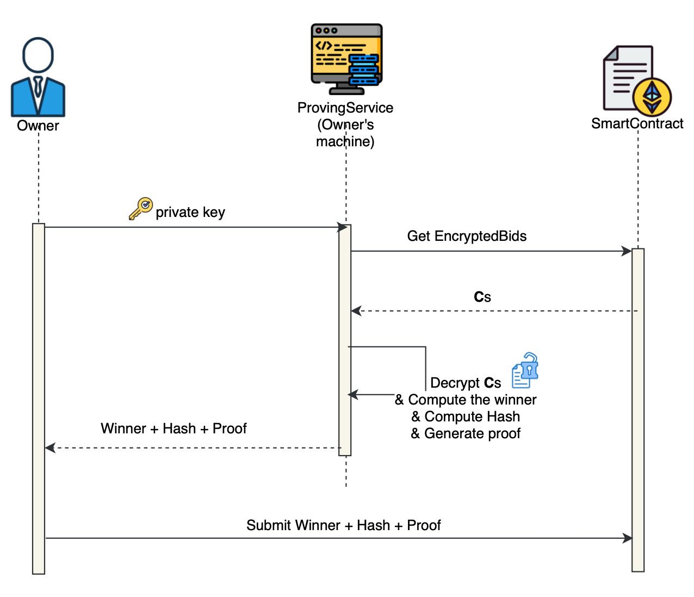

# SilentBid: On-Chain Sealed-Bid Auctions

## [Section 1] Project Information

- **Project Name**: SilentBid - On-Chain Sealed-Bid Auction Platform
- **Payment Details**: 0x9efE53369D4894Ca22C63f489023B324C3D519BA (Polygon Network)
- **Total Amount Requested**: 6,000 USDC

## [Section 2] Project Overview :page_facing_up:

### Brief Description

**SilentBid** is an [**on-chain sealed-bid auction platform**](https://www.investopedia.com/terms/s/sealed-bid-auction.asp) built using
**Circom**. It ensures secure, private auctions by leveraging **zero-knowledge proofs (ZKPs)** to identify the highest bidder without
disclosing individual bids. This approach guarantees both privacy and fairness in the auction process.

SilentBid also serves as a **reference model** for developers creating decentralized applications (dApps) using **Circom** and 
**ZKPs**.

### Core Idea

1. **Bid Phase**: Bidders submit encrypted bids to a smart contract. Only the auction owner can decrypt these bids using their
   private key.
2. **Open Phase**: The auction owner decrypts the bids and publishes the highest bid along with a ZK proof verifying the decryption. A
   hash of all inputs as public input of the circuit to ensure completeness and correctness.
3. **Verification**: The smart contract verifies the ZK proof, computes the results, and announces the winner.

#### Key Components

- **Proving Service**: Utilizes **Circom** to generate a ZK proof for bid decryption while protecting the auction owner’s private key.
- **Smart Contract**: Manages the entire auction lifecycle, including setup, bid collection, proof verification, and winner
  declaration.

### Technology Stack

- **Smart Contract**: Solidity
- **Circuit**: Circom
- **Encryption/Decryption**: [ElGamal asymmetric encryption](https://github.com/Shigoto-dev19/ec-elgamal-circom)
- **Hash Function**: Poseidon

### Design Mockups/Prototypes (Optional)

The auction process is divided into **on-chain** and **off-chain** phases:

1. **Setup Phase**: The auction owner initializes the auction by specifying deposit requirements, providing a public key, setting start
   and end times, and transferring assets to the contract.
2. **Bid Phase**: Bidders submit encrypted bids along with the required deposit.
3. **Open Phase**: The auction owner decrypts the bids and generates a ZK proof.
4. **Verification Phase**: The owner submits the proof and the winner to the smart contract, which validates and finalizes the auction.

#### Auction Flow (Illustrated)

1. **Initial Setup**  
   
2. **Bidding Phase**  
   
3. **Verification Phase**  
   

### Challenges

We initially considered using Plonky3 for implementation. However, due to the unavailability of relevant cryptographic and mathematical
libraries, we opted for Circom to meet the project timeline.

## [Section 3] Ecosystem Fit

### Similar Projects

Research on blockchain-based sealed-bid auctions highlights:

- [Anonymous Fair Auction on Blockchain](https://ieeexplore.ieee.org/document/9432664): A general scheme but lacks concrete
  implementation.
- [Blockchain-Based Sealed-Bid e-Auction with Smart Contracts & ZKPs](https://www.researchgate.net/publication/351717293_A_Blockchain-Based_Sealed-Bid_e-Auction_Scheme_with_Smart_Contract_and_Zero-Knowledge_Proof):
  Requires all bidders to participate in the verification phase, making it less user-friendly.

Other projects, such as [Auction Contract](https://github.com/HSG88/AuctionContract), implement auction logic in smart contracts but
lack robust privacy and security measures.

### Unique Contribution

SilentBid offers a **practical and secure reference** for developers building **ZK-based dApps**, demonstrating how **Circom** can
solve real-world privacy challenges.

## [Section 4] Team :busts_in_silhouette:

- **Team Members**: [SotaZK Labs](https://sotazk.org/) - specializing in zero-knowledge solutions for security and privacy.
- **Number of Members**: 7
- **Contact Information**:
    - **Name**: Steve Nguyen
    - **Email**: zk.steve.nguyen@gmail.com
    - **Telegram**: @zk_steve
- **Prior Work/Research (Optional):**
    - [ZKP Documentation](https://github.com/sota-zk-labs/zkp-documents): Covers KZG, GKR, FRI, Plonk, Groth16, lattice-based
      commitments, and more.
    - [ZKP Implementation](https://github.com/sota-zk-labs/zkp-implementation): Includes protocols such as KZG, FRI, and Plonk.
    - [Apstark](https://github.com/sota-zk-labs/apstark): A Layer 2 ZK rollup on the Aptos network using Starknet.

## [Section 5] Development Roadmap :open_book:

> **Important:** The maximum project duration is 6 weeks. Milestones and timelines are outlined accordingly.

### Milestone 1 — Core Functionality

- **Duration**: 5 weeks
- **Scope**: Develop the circuit, core smart contract, and auxiliary functions. Deliver a video demo of the application.
- **FTE (Full-Time Equivalent)**: 4
- **Budget**: 4,000 USDC

### Milestone 2 — Enhancements

- **Duration**: 3 weeks
- **Scope**: Refine code, write tests, fix bugs, and create developer documentation/tutorials.
- **FTE**: 4
- **Budget**: 2,000 USDC

### Total Costs: 6,000 USDC

## [Section 6] Extended Scope

### Future Plans

After completing this project, we plan to:

- Implement additional auction types such as **Unique Lowest Bid** and **Dutch Auctions**.
- Integrate with other **dApps** and explore partnerships with **DeFi platforms** to support automatic asset management post-auction.